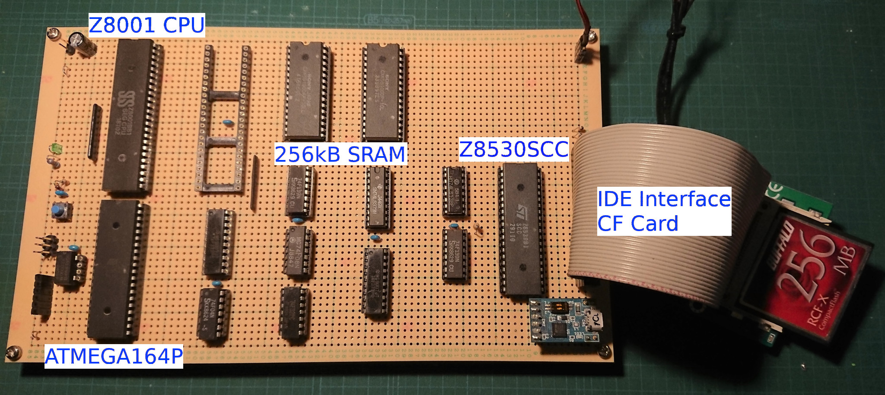

# Z8001MB
**Zilog Z8001 Microprocessor Board and CP/M-8000 porting**    
This board and ported CP/M-8000 can run a part of CP/M commands. However, software development tools, editor, assembler, etc, unfortunately do not work.

## Schematic
**Ciruit diaglam of the Z8001MB**    
Three PDFs shows CPU, memory and peripherals. This board does not have a memory management hardware. It is a reason why a prt of commands can run, others can not.

## z8kboot
**Boot program and machine code monitor for Z8001**
The boot program is for ATMEGA165P written in C language.
The machine code monitor is written in assembly language which can be assembled with GNU assembler.

## cpm8k
**CP/M-8000 BIOS for Z8001MB**    
The BIOS is written in assembly language. It has not supported IOBYTE. 

