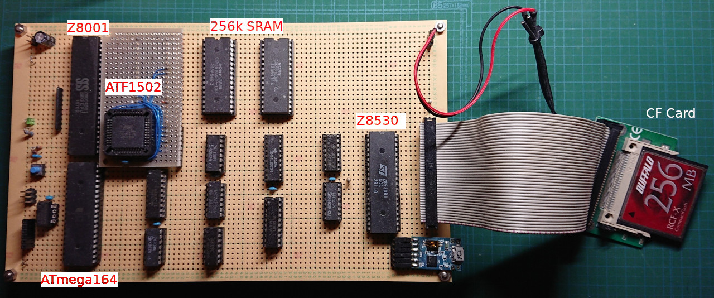

# Z8001MB - Building CP/M-8000 Machine Project 
**Zilog Z8001 Microprocessor Board and CP/M-8000 porting**    
This board is designed to run CP/M-8000 released by Digital Research in 1984. It runs at 6MHz clock speed, and has 256k bytes SRAM, two serial ports, and one 8 bit IDE interface to connect CF memory card. This board has a simple memory mapping hardware in a CPLD to split I/D spaces. It makes possible to run CP/M-8000 commands, such as assembler and C compiler.

## In the directories   
## schematic
**Circuit diagrams of the Z8001MB**    
Three PDFs shows circuit diagrams of CPU, memory, memory mapping logic and interfaces. 

**My had-wired borad**
 

## z8kboot
**Boot program and machine code monitor for Z8001**  
The boot program runs on ATMEGA165P after resetting, and transfers a machine code monitor to the SRAM.  The machine code monitor is written in assembly language, GNU AS.

## cpm8k
**CP/M-8000 BIOS for Z8001MB**    
The original CP/M-8000 BIOS was written in C language. But it makes hard to implement BIOS on other machines without running CP/M-8000. So, I wrote a BIOS with GNU assembler under Linux, converted the CP/M-8000 object file and libraries to COFF object format, and linked them with GNU linker. It makes easy to buid CP/M-8000 system. 

**Running CP/M-8000**    

