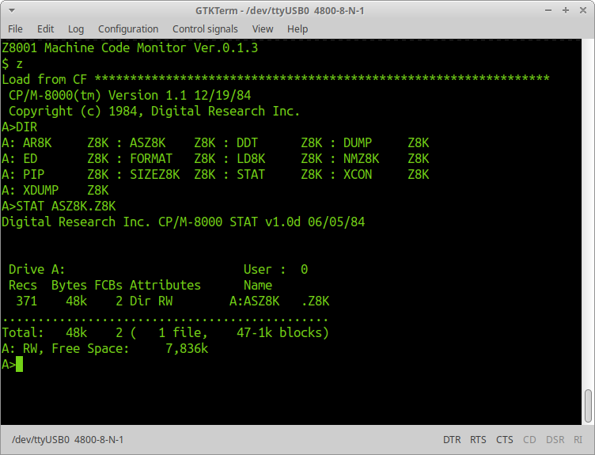

# Z8001MB
**Zilog Z8001 Microprocessor Board and CP/M-8000 porting**    
This board is designed to run CP/M-8000, Digital Research released in 1984. It runs at 6MHz, and has 256k bytes SRAM, two serial ports, and one 8 bit IDE interface. 

## Schematic
**Circuit diagram of the Z8001MB**    
Three PDFs shows circuit diagrams of CPU, memory and peripherals. This board has a simple memory mapping hardware in a CPLD to split I/D spaces. It makes it possible to run CP/M-8000 commands, such as assembler and C compiler, which need I/D space separation.

## z8kboot
**Boot program and machine code monitor for Z8001**
The boot program runs on ATMEGA165P after resetting, and transfers a machine code monitor on the SRAM.
The machine code monitor is written in assembly language which can be assembled with GNU assembler.

## cpm8k
**CP/M-8000 BIOS for Z8001MB**    
The original CP/M-8000 BIOS was written in C language. But it is impossible to implement BIOSs for other machines without running CP/M-8000. So, I wrote a BIOS with GNU assembler under Linux, converted the CP/M-8000 body and libraries to COFF object format, and linked them with GNU linker. 

