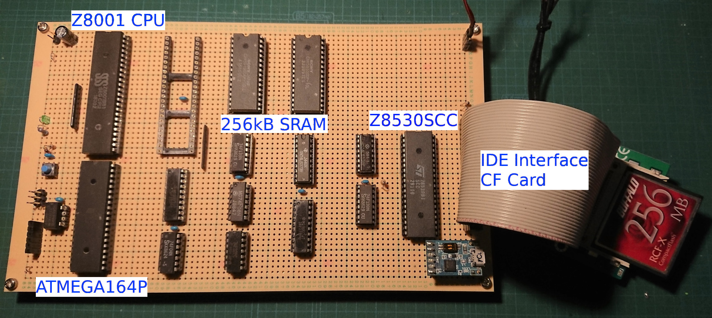

# Z8001MB

This Board is designed for Zilog Z8001. The CPU runs at 6MHz clock speed, and it has 256kB SRAM, 2ch Serial ports and one IDE interface. 

* 6MHz CPU clock is generated from the 12MHz crystal oscillator by ATMEGA164 micro controller. 74F TTL logic ICs are chosen for 10MHz clock. At slower clock speed, 4 or 6MHz, 74LS logic ICs would be work. 
* This board doesn't have ROMs to store a boot program. At the boot up ATMEGA164 controls Z8001 CPU bus, and write the boot code to the RAM. After the copying, ATMEGA frees the bus and negates the reset signal. Then Z8001 CPU wakes up. 
* 256kB SRAM was chosen for running CP/M-8000 which requires at least 128kB RAM. 
* Zilog Z8530 SCC is a serial communication controller chip. A z8kmon, machine monitor, uses it at 4800bps for a console I/O. To connect PC you need a level converter or a  USB-Serial converter.
* IDE interface is connected with 8bit bus. 16bit connection may be work, but I haven't tried yet. A CF card is connected through  an adapter, and stores the CP/M-8000 disk image in it.

To work this board you need to write boot code to the ATMEGA chip, and change fuse bits to disable JTAG and choose external clock input.

2020.05.10  
To support Code and Data address space splitting, a CPLD ATF1502 is added. It maps different address spaces for code and data access that some CP/M-8000 commands require. Z8kMMAP.PLD is the configuration file for the CPLD. I think it can be replaced with GAL because the address space mapping logic is simple.