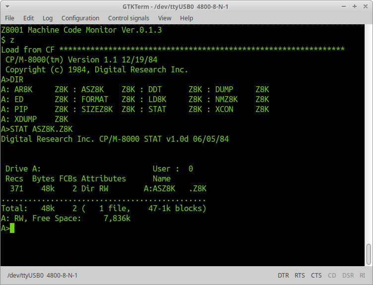

# CP/M-8000



This directory includes CP/M-8000 BIOS source codes for the Z8001MB board. You can build your own CP/M-8000 system by cross assembling on Linux and Windows. 

## Preparation
* Download GNU Binutils and buid it with **--target==z8k-coff** option. I use GNU Binutils 2.34.
* Download **CP/M-8000 1.1** in [Digital Research Source Code](http://www.cpm.z80.de/source.html) and unzip it. There are 4 disk images containing CP/M commands in the ZIP file.   
* Install cpmtools package, and append the **diskdefs** in the cpm8k directory to **/etc/cpmtools/diskdefs**. 

## Build and make a boot disk image
* Type **make** in the cpm8k directory.
* Copy CP/M commands from **CP/M-8000 1.1** into diska/b/c/d directories.
* Type **make dskimg**
* Write **cpm8k.bin** to the boot drive with dd command.
 
```
In the cpm8k directory
$ make 
$ make diskimg
$ sudo dd if=cpm8k.bin of=/dev/sdx 
``` 
**"sdx"** is your drive to write the boot disk image.  
Executing **dd** with care. Do not set a wrong disk drive for **"of"**.    

## License
cpmsys.rel, cpmsys.o and libcpm.a - licensed by Lineo,Inc. See "The Unofficial CP/M Web Site"   
others - MIT License
